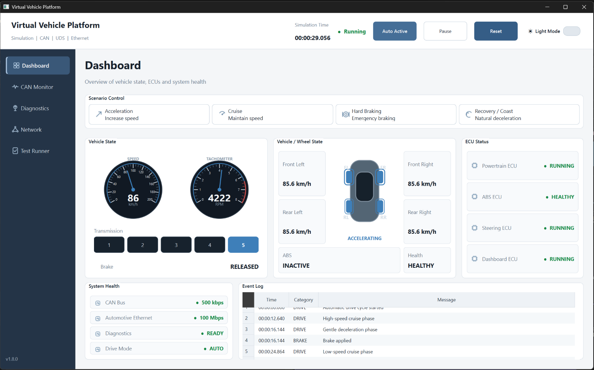
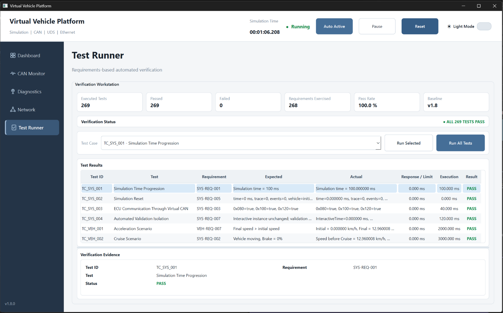
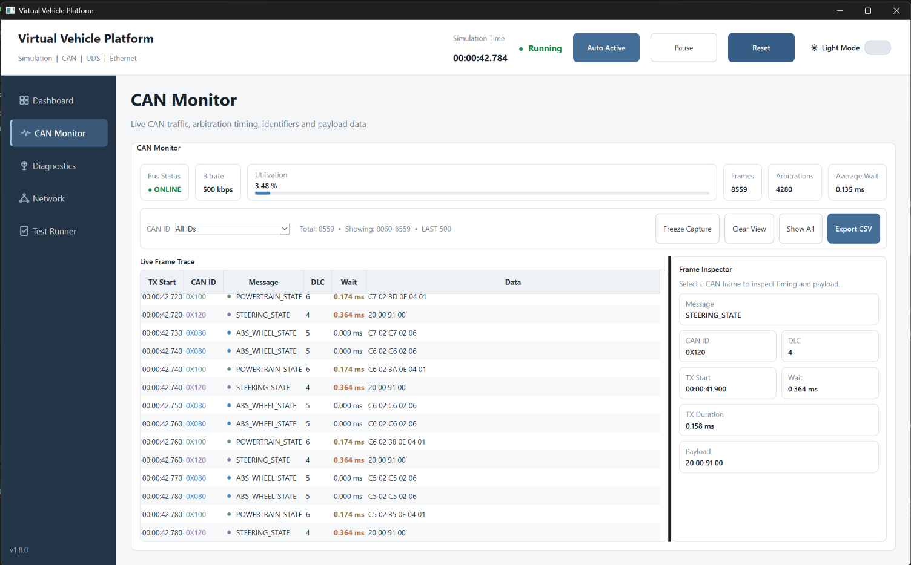
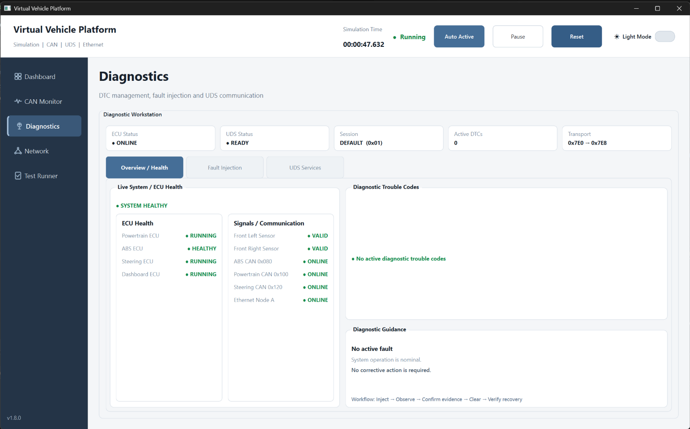
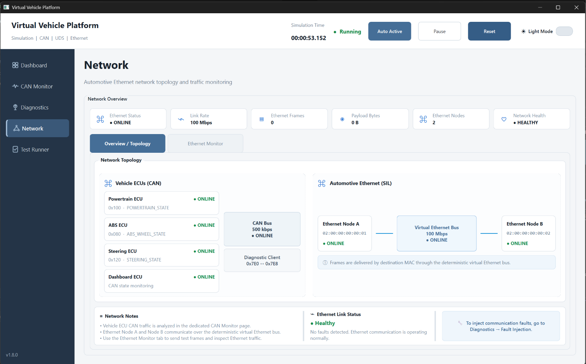

# VirtualVehicle

**C++20 Software-in-the-Loop Automotive Simulation & Verification Platform**

CAN • UDS • ISO-TP • DTC • Fault Injection • Automotive Ethernet • Qt 6 • Requirements-Based Verification

**Baseline v1.8 — VERIFICATION CLOSED — 269 / 269 automated tests PASS**



## Overview

VirtualVehicle is a desktop **Software-in-the-Loop (SIL)** platform for modeling, exercising, monitoring, and verifying automotive software behavior without requiring physical vehicle hardware.

The project combines deterministic vehicle simulation, virtual ECUs, CAN communication, diagnostic services, fault injection, Automotive Ethernet, requirements-based automated verification, and a Qt desktop interface in a single C++20 codebase.

The goal is not to emulate a production vehicle or physical CAN/Ethernet transceiver. Instead, VirtualVehicle provides a controlled software environment for practicing and demonstrating embedded-software architecture, communication behavior, diagnostics, verification, traceability, and deterministic testing.

## Verification Baseline

| Metric | Baseline v1.8 |
| --- | ---: |
| Automated tests executed | **269** |
| Passed | **269** |
| Failed | **0** |
| Pass rate | **100.0%** |
| Unique primary requirement IDs exercised by Test Runner | **268** |
| Verification status | **CLOSED** |

The 268 value is the number of **unique primary requirement IDs exercised by the automated Test Runner**. It is intentionally distinct from the number of executed test cases; test-to-requirement relationships are not necessarily one-to-one, and the verification baseline also includes inspection/regression evidence.



## What the Platform Demonstrates

- **C++20 architecture** with modular simulation, communication, diagnostics, transport, ECU, GUI, and verification layers.
- **Software-in-the-Loop vehicle simulation** with acceleration, cruise, hard braking, and recovery/coast scenarios.
- **Virtual ECUs** for powertrain, ABS, steering, and dashboard behavior.
- **CAN communication** with frame encoding/decoding, identifiers, payloads, timing, arbitration, statistics, and trace inspection.
- **UDS diagnostics** transported through the simulated CAN path.
- **ISO-TP transport** for diagnostic payload segmentation and reassembly.
- **DTC management and fault injection**, including sensor and communication fault scenarios.
- **Automotive Ethernet SIL modeling** with virtual MAC addressing, frame delivery, timing, trace, statistics, and deterministic execution.
- **Requirements-based verification** with explicit requirement IDs, test cases, expected/actual evidence, regression coverage, and traceability documentation.
- **Deterministic simulation behavior** suitable for repeatable automated verification.
- **Qt 6 desktop tooling** for interactive monitoring and engineering-oriented visualization.

## Architecture

```text
                         +---------------------------+
                         |        Qt 6 GUI           |
                         |---------------------------|
                         | Dashboard                 |
                         | CAN Monitor               |
                         | Diagnostics               |
                         | Network / Ethernet        |
                         | Test Runner               |
                         +-------------+-------------+
                                       |
                                       v
                         +---------------------------+
                         |     SimulationEngine      |
                         |---------------------------|
                         | Deterministic time        |
                         | Vehicle scenarios         |
                         | ECU scheduling            |
                         | Fault injection           |
                         | Diagnostic runtime        |
                         +------+------+-------------+
                                |      |
                  +-------------+      +------------------+
                  v                                       v
        +---------------------+                +----------------------+
        | Virtual CAN Bus     |                | Virtual Ethernet Bus |
        |---------------------|                |----------------------|
        | Arbitration         |                | MAC addressing       |
        | Timing / trace      |                | Link timing          |
        | Statistics          |                | Trace / statistics   |
        +----------+----------+                +----------+-----------+
                   |                                      |
          +--------+---------+                     +------+------+
          |                  |                     |             |
          v                  v                     v             v
   +-------------+    +-------------+        Ethernet       Ethernet
   | Vehicle ECUs|    | Diagnostics |        Node A         Node B
   |-------------|    |-------------|
   | Powertrain  |    | UDS         |
   | ABS         |    | ISO-TP      |
   | Steering    |    | DTC         |
   | Dashboard   |    | Runtime     |
   +-------------+    +-------------+
```

The runtime preserves a shared communication path: CAN traffic participates in the same virtual bus/arbitration model before being routed to the appropriate ECU or diagnostic layer.

## CAN Simulation

VirtualVehicle models a deterministic virtual CAN environment used by the simulated ECUs and diagnostic communication.

Current vehicle-state traffic includes:

| CAN ID | Message |
| --- | --- |
| `0x080` | `ABS_WHEEL_STATE` |
| `0x100` | `POWERTRAIN_STATE` |
| `0x120` | `STEERING_STATE` |
| `0x7E0` | Diagnostic request |
| `0x7E8` | Diagnostic response |

The CAN layer includes:

- CAN frame representation.
- Standard arbitration behavior where the lower arbitration ID has priority.
- Periodic ECU transmission scheduling.
- Transmission timing and wait-time evidence.
- Bus statistics.
- Complete backend trace.
- GUI filtering and frame inspection.
- CSV trace export.



The CAN Monitor intentionally bounds the live GUI view for responsiveness while preserving the complete backend trace for analysis and export.

## Vehicle and ECU Simulation

The platform models several software ECUs and exposes their state through the GUI:

- **Powertrain ECU** — vehicle speed, engine RPM, gear, and brake-related state.
- **ABS ECU** — wheel-speed state and ABS-related behavior.
- **Steering ECU** — steering-state communication.
- **Dashboard ECU** — consumes and presents vehicle communication state.

Interactive scenarios include:

- Acceleration
- Cruise
- Hard Braking
- Recovery / Coast
- Automatic drive-cycle execution

The dashboard presents simulation time, vehicle state, wheel state, transmission state, ECU health, communication health, and event evidence.

## Diagnostics: UDS, ISO-TP and DTCs

VirtualVehicle includes a diagnostic subsystem integrated with the simulated CAN runtime.

The diagnostic architecture covers:

- UDS request/response handling.
- Diagnostic CAN identifiers `0x7E0` and `0x7E8`.
- ISO-TP transport behavior for diagnostic communication.
- Diagnostic session behavior.
- Positive and negative diagnostic response handling.
- DTC registration and clearing.
- Diagnostic state inspection.
- Runtime diagnostic transactions through the shared virtual CAN bus.

The GUI provides an engineering workstation for health monitoring, fault injection, DTC inspection, and UDS service interaction.



## Fault Injection

The platform supports controlled fault scenarios for verification and recovery testing.

The v1.8 diagnostic fault expansion includes communication-fault injection for:

- ABS CAN communication.
- Powertrain CAN communication.
- Steering CAN communication.
- Automotive Ethernet Node A.

The verification suite checks fault injection, communication suppression, DTC registration, recovery, reset behavior, and deterministic execution.

The v1.8 DFX expansion added **15 automated verification tests**, all passing.

## Automotive Ethernet

VirtualVehicle also includes a deterministic software model of Automotive Ethernet communication.

The current SIL Ethernet model includes:

- Virtual Ethernet frames.
- Configurable link rate.
- Virtual MAC addresses.
- Registered Ethernet nodes.
- Destination-based frame delivery.
- Transmission and waiting-time calculation.
- Ethernet trace.
- Link statistics.
- Integration with `SimulationEngine`.
- Communication-fault injection.
- Deterministic regression verification.

Current simulated topology:

```text
Ethernet Node A                Virtual Ethernet Bus               Ethernet Node B
02:00:00:00:00:01   <------>       100 Mbps          <------>   02:00:00:00:00:02
```

The timing model is intentionally simplified for SIL use and is not presented as a complete physical-layer Ethernet implementation.



## Requirements-Based Verification

Verification is a first-class part of the project rather than an afterthought.

The repository contains requirement specifications and traceability artifacts covering areas such as:

- System behavior
- Vehicle behavior
- Sensors
- CAN
- ECU behavior
- Diagnostics
- DTCs
- UDS
- ISO-TP
- UDS CAN transport
- Runtime diagnostic integration
- Automotive Ethernet
- Diagnostic fault expansion
- Validation and inspection evidence

Automated test cases use explicit IDs such as:

```text
TC_SYS_001
TC_VEH_001
TC_CAN_...
TC_UDS_...
TC_ETH_...
TC_DFX_...
```

and associate execution evidence with requirement IDs such as:

```text
SYS-REQ-001
VEH-REQ-...
ETH-REQ-...
DFX-REQ-...
```

Baseline v1.8 closes with:

```text
Automated Tests:          269
Passed:                   269
Failed:                     0
Pass Rate:              100.0%
Primary Requirement IDs
Exercised by Test Runner: 268

Verification Status: CLOSED
```

The Test Runner exposes expected behavior, actual evidence, execution result, requirement association, and timing information directly in the GUI.

## Determinism and Regression

Repeatability is important for a useful SIL verification environment.

VirtualVehicle includes automated checks for deterministic behavior across simulation and communication components. The final Automotive Ethernet verification tail includes:

- `ETH-REQ-034` — Regression safety
- `ETH-REQ-035` — Legacy Baseline v1.6 regression
- `ETH-REQ-036` — Ethernet determinism
- `ETH-REQ-037` — System determinism with Ethernet enabled

The complete v1.8 suite was rerun after final requirement/test alignment and completed with **269 PASS / 0 FAIL**.

## GUI

The Qt desktop application contains five primary engineering views.

### Dashboard

Vehicle state, drive scenarios, gauges, wheel state, ECU status, system health, and event logging.


### CAN Monitor

Live CAN trace, arbitration timing, utilization, frame filtering, payload inspection, and CSV export.


### Diagnostics

ECU health, communication status, DTC management, fault injection, and UDS interaction.


### Network

Automotive Ethernet topology, link state, virtual nodes, traffic monitoring, timing, and statistics.


### Test Runner

Requirements-based automated verification with expected/actual evidence and baseline-level execution metrics.


## Technology Stack

| Area | Technology |
| --- | --- |
| Language | C++20 |
| GUI | Qt 6 Widgets |
| Build | CMake |
| Primary development environment | Visual Studio / MSVC |
| Simulation | Custom deterministic SIL runtime |
| Vehicle communication | Virtual CAN |
| Diagnostics | UDS + ISO-TP |
| Diagnostic evidence | DTCs + fault injection |
| Network simulation | Virtual Automotive Ethernet |
| Verification | Custom requirements-based automated test framework |
| Documentation | Markdown requirements and traceability artifacts |

## Repository Structure

```text
VirtualVehicle/
├── can/                 # CAN frames, codecs, bus behavior and timing
├── diagnostics/         # UDS, DTC and diagnostic services
├── ecu/                 # Virtual vehicle ECUs
├── ethernet/            # Virtual Automotive Ethernet model
├── gui/                 # Qt desktop application and widgets
├── message/             # Communication/message definitions
├── requirements/        # Requirements, traceability and verification evidence
├── sensor/              # Simulated sensor behavior
├── simulation/          # SimulationEngine and runtime behavior
├── test/                # Automated requirements-based verification
├── transport/           # ISO-TP / diagnostic transport
├── validation/          # Validation-related support
├── vehicle/             # Vehicle state and scenario behavior
└── CMakeLists.txt
```

## Build Requirements

The current desktop configuration is developed and verified with:

- Windows
- C++20-capable MSVC toolchain
- CMake
- Qt 6 Widgets
- Visual Studio

Qt must be installed with an MSVC-compatible kit and discoverable by CMake.

A typical CMake workflow is:

```bash
cmake -S . -B out/build -DCMAKE_PREFIX_PATH="C:/Qt/6.x.x/msvcXXXX_64"
cmake --build out/build --config Release
```

The exact Qt path depends on the locally installed Qt version and compiler kit.

The project can also be opened as a CMake project in Visual Studio and configured with the installed Qt MSVC kit.

## Running the Platform

After a successful build, launch the `VirtualVehicle` desktop target.

From the GUI you can:

1. Run the automatic drive cycle or select a manual vehicle scenario.
2. Inspect CAN traffic and arbitration evidence.
3. Interact with diagnostics and inject controlled faults.
4. Inspect Automotive Ethernet topology and traffic.
5. Execute individual verification cases or the complete automated suite.

## Scope and Engineering Intent

VirtualVehicle is a **portfolio and engineering-learning SIL platform**. It demonstrates software architecture, deterministic communication modeling, diagnostic behavior, automated verification, and traceability concepts in a controlled environment.

It does **not** claim to replace:

- Production ECU software.
- Physical HIL benches.
- Certified vehicle-network stacks.
- Physical CAN or Ethernet transceivers.
- Complete AUTOSAR implementations.
- OEM-specific diagnostic stacks.
- Formal safety certification.

The project is designed to make the software and verification concepts observable, testable, and repeatable without specialized hardware.

## Baseline History

| Baseline | Automated Result | Major Milestone |
| --- | ---: | --- |
| v1.2 | 84 PASS | Core verification baseline |
| v1.3 | 102 PASS | DTC expansion |
| v1.4 | 135 PASS | UDS |
| v1.5 | 188 PASS | ISO-TP + UDS transport |
| v1.6 | 217 PASS | Runtime UDS shared-bus integration |
| v1.7 | 254 PASS | Automotive Ethernet |
| **v1.8** | **269 PASS** | **Diagnostic communication fault expansion + verification closure** |

## Current Status

**VirtualVehicle v1.8.0**

```text
269 / 269 automated tests PASS
0 failures
100.0% pass rate
Verification baseline CLOSED
```

The v1.8 source, requirements, verification evidence, and GUI are frozen as the current stable portfolio baseline.

---

Built as a hands-on C++ automotive software, SIL, diagnostics, networking, and verification portfolio project.
